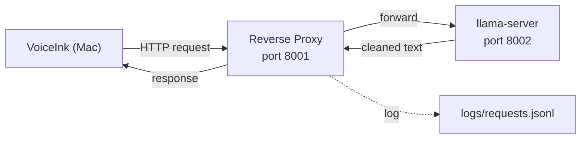
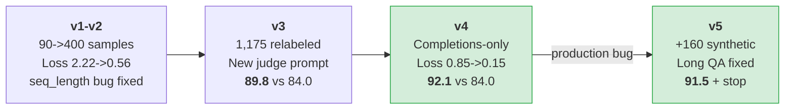
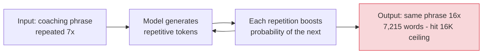

# Fine-Tuning Qwen 3.5 2B for Real-Time Dictation Cleanup

*On a held-out set of real dictation-cleanup requests, this fine-tuned Qwen 3.5 2B beat same-quant Qwen 3.5 2B, 4B, 9B, 27B, and 35B-A3B baselines — while running 2-17x faster than every larger model.*

---

**TL;DR**

- Logged 1,451 real dictation requests through a reverse proxy — normal usage became dataset collection.
- Used Claude to label gold-standard outputs and run comparative A/B evaluation.
- Fine-tuned Qwen 3.5 2B with LoRA on an RTX 4080 Super (16GB VRAM).
- The biggest quality jump came from completions-only training (loss dropped from ~0.85 to ~0.15).
- A production failure on long transcripts exposed a training data distribution gap — 10 samples over 500 words out of 1,451.
- Adding 160 synthetic long-form QA samples fixed the failure.
- Final model beat same-quant Qwen 2B (+11.4), 4B (+10.1), 9B (+9.3), 27B (+4.4), and 35B-A3B (+5.0) baselines on this task. All gaps statistically significant (p < .0001).

---

## The Problem

I use [VoiceInk](https://voiceink.app), a macOS dictation app, to talk to coding agents — Claude Code, mostly. I dictate instructions, questions, code reviews, debugging sessions. VoiceInk transcribes my speech, cleans it up with an LLM, and sends the result to whatever tool I'm working in.

That creates two very different cleanup workloads:

**Short dictation** — the common case. Quick instructions to a coding assistant: "Can you check the previous lap for timing data?" or "Fix the bug in the coaching overlay." 10-100 words, fired hundreds of times a day.

**Long QA debriefs** — the edge case that matters. I build [GT Coach](https://gtcoach.app) ([GitHub](https://github.com/gt-coach/gt-coach-releases/releases)), a sim-racing coaching app for Gran Turismo 7. When I QA-test it, I drive in the simulator while the app speaks corner-by-corner feedback aloud ("Corner 2, brake one beat earlier. It carried into corner 3. Your mid-corner speed is down."). I narrate my observations into a microphone, then upload the recording for transcription. These debriefs run 2,000-3,500 words — thirty minutes of driving commentary interleaved with repeated coaching phrases.

Both need real-time cleanup. My raw dictation comes with filler words ("so", "like", "basically"), French grammar patterns (I'm a native French speaker — "we are Monday" instead of "today is Monday"), and speech-to-text misrecognitions. The LLM's job is to fix all of that transparently.

Off-the-shelf [Qwen 3.5](https://qwen.ai/blog?id=qwen3.5) models gave me a frustrating tradeoff: 4B and 9B were usable but laggy, while 2B was fast but couldn't follow cleanup instructions reliably. So I built a pipeline to collect real dictation logs, label them with Claude, fine-tune the 2B, and evaluate whether it could replace the larger models.

Here's what that cleanup looks like in practice — real samples from the training data:

> **Raw:** So if you reflect on all the messages I've sent to you in this conversation, I've actually dictated all of them through Voice Inc. and they all went through QEN 3.5 Forbi.
>
> **Cleaned:** If you reflect on all the messages I've sent to you in this conversation, I've dictated all of them through VoiceInk and they all went through Qwen 3.5 4B.

> **Raw:** the Allian lab shows a much later breakpoint into term three.
>
> **Cleaned:** The alien lap shows a much later brake point into turn 3.

> **Raw:** The breakpoint for chicken 17 is about 50 meters before the entry.
>
> **Cleaned:** The brake point for chicane 17 is about 50 meters before the entry.

> **Raw:** So I think the correct fix is probably there's two fixes we need to do. One is we need to mutate locally this reference package, which I believe is a binary file with like the prefixes, some kind of like metadata to switch from monza to monza node chicain
>
> **Cleaned:** I think there are two fixes we need to do. One is we need to locally mutate this reference package, which I believe is a binary file with the prefixes, some kind of metadata to switch from Monza to Monza No Chicane.

Filler removal, phonetic STT correction (Parakeet V2 produces real English words that sound right but mean something completely different), grammar cleanup for non-native phrasing — these are the three recurring failure modes the model needs to handle.

## How I Evaluate

Before getting into the pipeline details, here's how I measured quality — because the numbers that follow depend on it.

For each held-out eval sample, both models clean the same transcript. Claude Sonnet 4.6 judges the two outputs side by side on a [six-dimension rubric](https://github.com/hourliert/VoiceInk-Qwen3.5-2B-FT/blob/master/src/eval/judge_prompt.txt), each scored 1-5 and weighted by importance. Output order (A/B) is randomized per sample to cancel positional bias. Per-dimension p-values come from paired Wilcoxon signed-rank tests; the overall score gap includes a bootstrap 95% CI; win rate uses a Wilson score interval.

| Dimension | Weight | What it measures |
|---|---|---|
| Meaning preservation | 3x | Did it faithfully represent what was said? |
| Instruction following | 3x | Did it stay in role as a transcription enhancer? |
| Filler removal | 2x | Did it clean verbal tics and conversational fluff? |
| Grammar/fluency | 2x | Did it fix errors, especially non-native patterns? |
| Technical accuracy | 2x | Did it get names and terms right per vocabulary? |
| Conciseness | 1x | Did it tighten unnecessary verbosity? |

These are task-specific results on held-out real dictation-cleanup samples — practical product evaluations, not general-purpose model rankings. 161 eval samples per comparison.

## The Reverse Proxy

The initial setup was [llama.cpp](https://github.com/ggerganov/llama.cpp) (`llama-server`) running on my gaming PC — an RTX 4080 Super with 16GB VRAM, sitting on the network. VoiceInk pointed at the server's IP. I was experimenting with different Qwen 3.5 model sizes:

| Model | Tokens/sec | Time to first token |
|---|---|---|
| 9B | ~90 | ~300ms |
| 4B | ~140 | ~280ms |
| 2B | ~250 | ~150-200ms |

The larger models were decent but laggy. The 2B was fast but terrible at following instructions. Across all sizes, I was constantly noticing problems — misrecognitions, unclear cleanups, models answering questions from the transcript instead of cleaning them — but had no way to systematically understand what was going wrong. I couldn't inspect what VoiceInk was sending or correlate specific inputs with bad outputs.

The turning point was inserting a tiny Python reverse proxy ([`src/voiceink_proxy/server.py`](https://github.com/hourliert/VoiceInk-Qwen3.5-2B-FT/blob/master/src/voiceink_proxy/server.py)) between VoiceInk and llama-server.



Every request and response gets logged as structured JSONL:

```json
{
  "request_id": "8481b1e4-...",
  "timestamp": "2026-03-08T14:23:01+00:00",
  "method": "POST",
  "path": "/v1/chat/completions",
  "status_code": 200,
  "duration_ms": 892.4,
  "model": "Qwen3.5-4B",
  "raw_request_json": "{ system prompt, transcript, vocabulary, context... }",
  "raw_response_json": "{ model output... }",
  "response_text": "The cleaned transcript text."
}
```

From that moment on, normal usage doubled as dataset collection. Every dictation I did was automatically captured as training data — the raw transcript, the system prompt, the custom vocabulary, clipboard context, window context, the model's output, latency. Over a thousand real-world samples, passively, with zero annotation effort.

This turned out to be the single most important decision in the project.

The proxy also handles a quirk of Qwen 3.5: even with thinking mode disabled, the model occasionally leaks `</think>` tokens. The proxy injects `</think>` as a stop token into every request, catching these before they reach VoiceInk. A [systemd service](https://github.com/hourliert/VoiceInk-Qwen3.5-2B-FT/blob/master/systemd/llama-router.service) runs everything on boot. The entire proxy is standard-library Python — no pip dependencies.

## The Road to Fine-Tuning

I went through several models before deciding to fine-tune:

**9B** — acceptable quality, too much latency. At ~90 tokens/second, the generation delay was distracting on every dictation.

**4B** — clearly faster at ~140 tok/s, and quality was essentially identical to 9B (later evaluation scored them 81.4 vs 81.6 — indistinguishable). But long QA debriefs were a problem for both — they'd produce excessively long output on 3,000+ word transcripts, often hitting the context window ceiling without finishing.

**Parakeet V2** — I switched VoiceInk's speech-to-text engine from Whisper to Parakeet. Faster, but introduced more phonetic misrecognitions: "Claude Code" became "cloud code", "brake" became "break", "GT Coach" became "D V Coach". This made the LLM cleanup step more important — the model now needed to detect and correct phonetic substitutions using context clues and VoiceInk's custom vocabulary list.

**2B with prompt engineering** — fast enough, but it couldn't follow cleanup instructions reliably. It would answer questions from the transcript, add commentary, miss filler words, fail to correct STT errors. The instruction-following gap was real and couldn't be closed with prompting.

That's when I decided to fine-tune.

## The Pipeline

The pipeline has four stages: collect real requests, label ideal outputs, fine-tune the model, then run comparative A/B evaluation. Each stage exists because the previous one exposed a real bottleneck in the product.


### Labeling

Each raw transcript from the proxy logs gets sent to Claude Sonnet 4.6 with a [judge prompt](https://github.com/hourliert/VoiceInk-Qwen3.5-2B-FT/blob/master/src/labeling/judge_prompt.txt). The judge receives the transcript along with structured context — custom vocabulary, clipboard content, active window title — and produces the ideal cleaned version.

The judge prompt went through three iterations. v1 passed the entire raw request as a blob — simple, but hard to control. v2 added rules based on manual review: I found the judge was over-cleaning, stripping genuine reactions like "Cool" and "That's fair", sometimes fabricating content, and producing fragments. Each problem became an explicit rule.

v3 was a full rewrite aligned with a [product specification](https://github.com/hourliert/VoiceInk-Qwen3.5-2B-FT/blob/master/docs/PRODUCT_SPEC.md) I wrote to codify exactly what "good cleanup" means. It switched to structured placeholders (`{transcript}`, `{custom_vocabulary}`, `{clipboard_context}`, `{window_context}`) and added guidance for French-English transfer patterns and Parakeet's specific misrecognition patterns. 1,451 samples labeled in about an hour with 5 concurrent Claude CLI calls.

It turned out that iterating on label quality moved results more than hyperparameter tuning did — more on that in [v3](#v3-better-labels).

### Dataset Preparation

Converts labeled records into [ChatML](https://huggingface.co/docs/transformers/en/chat_templating) format for Unsloth training. The script extracts structured components from each record and reconstructs messages using a configurable system prompt — decoupling training data from whatever prompt VoiceInk happened to send at recording time. This means I can iterate on the VoiceInk prompt without relabeling.

Data is split 90/10 into train and eval sets with a seeded shuffle for reproducibility.

### Training

Fine-tuning uses [Unsloth](https://unsloth.ai/) ([GitHub](https://github.com/unslothai/unsloth)) for LoRA on [Qwen 3.5 2B](https://huggingface.co/Qwen/Qwen3.5-2B). Qwen 3.5 is technically a unified vision-language model, which means using `FastVisionModel` even for text-only input.

The training script evolved across iterations, picking up features driven by real problems: completions-only training (the single biggest quality improvement — more below), dataset snapshots for reproducibility, GGUF auto-backup after I accidentally overwrote a model I wanted to compare against, and quantization flexibility for fitting longer sequences in 16GB VRAM.

### Evaluation

The eval pipeline drives the whole iteration loop. For each held-out sample, both models produce output from the same input. Claude judges the outputs side-by-side, scoring on the six-dimension rubric. The A/B assignment is randomized per sample, and each sample's custom vocabulary is passed to the judge so it can properly score technical accuracy — without it, the judge has no way to know "cloud code" should be "Claude Code".

The eval pipeline had its own bugs:

**`max_tokens: 256`**: The first version hardcoded a 256-token output cap in the eval inference call. This silently truncated model output — the repetition amplification bug on long transcripts was invisible to eval the entire time because it cut output off early. Removing this cap to match production was essential.

**Cold-load latency bias**: llama-server lazy-loads models on first request. Adding a warmup request before each model's timed run eliminated this.

## Training Iterations



### v1-v2: Foundations

The first run used 90 labeled samples with default hyperparameters. Loss dropped from 2.22 to 0.56 — the model learned the general shape of the task. But there was a configuration bug: `max_seq_length` was set to 16384 in the script but never passed to `FastVisionModel.from_pretrained()`. Unsloth silently defaulted to 2048. The model had never seen a full-length VoiceInk prompt during training — the system prompt alone is over 2,000 tokens.

After fixing the sequence length bug and labeling more data (~400 samples), v2 trained on the full context. The model improved, but loss remained high (~0.85 average) — more on why below.

### v3: Better Labels

I reviewed labeled samples and found the judge was over-cleaning: stripping genuine reactions, fabricating content, producing fragments. The fix wasn't more training — it was better data. I wrote a [product spec](https://github.com/hourliert/VoiceInk-Qwen3.5-2B-FT/blob/master/docs/PRODUCT_SPEC.md) to codify what "good cleanup" means, rebuilt the judge prompt from scratch, and relabeled all 1,175 samples.

The fine-tuned 2B scored 89.8 against the 4B baseline's 84.0. Closing the gap, but not yet surpassing it.

### v4: Completions-Only Training

This was the breakthrough — and it came from changing *what* the model trains on, not *how*.

I had been training on the entire sequence: system prompt, user message, and assistant response. But the system prompt and user message are provided at inference time; the model doesn't need to learn to predict them. Worse, VoiceInk's system message includes dynamic context that changes with every request — the current clipboard content, the active window title, the custom vocabulary. A 2B model was wasting significant capacity trying to learn patterns in this unpredictable context.

Switching to **completions-only training** masks the loss on everything except the assistant response:

```
Training on full sequence (before):              Completions-only (after):
┌──────────────────────────────┐                 ┌──────────────────────────────┐
│ System: You are a dictation  │ ◄─ loss         │ System: You are a dictation  │ ◄─ masked
│ enhancer. Clean up the text, │ ◄─ loss         │ enhancer. Clean up the text, │ ◄─ masked
│ fix grammar, remove fillers. │ ◄─ loss         │ fix grammar, remove fillers. │ ◄─ masked
│ [clipboard, vocab, context]  │ ◄─ loss         │ [clipboard, vocab, context]  │ ◄─ masked
├──────────────────────────────┤                 ├──────────────────────────────┤
│ User: <TRANSCRIPT>So like    │ ◄─ loss         │ User: <TRANSCRIPT>So like    │ ◄─ masked
│ the break point for chicken  │ ◄─ loss         │ the break point for chicken  │ ◄─ masked
│ 17 is about 50 meters...</   │ ◄─ loss         │ 17 is about 50 meters...</   │ ◄─ masked
├──────────────────────────────┤                 ├──────────────────────────────┤
│ Assistant: The brake point   │ ◄─ loss         │ Assistant: The brake point   │ ◄─ LOSS
│ for chicane 17 is about 50   │ ◄─ loss         │ for chicane 17 is about 50   │ ◄─ LOSS
│ meters before the entry.     │ ◄─ loss         │ meters before the entry.     │ ◄─ LOSS
└──────────────────────────────┘                 └──────────────────────────────┘
    avg loss: ~0.85                                  avg loss: ~0.15
```

The model focuses entirely on learning to produce clean output given the input context, rather than trying to predict the context itself. Using Unsloth's `UnslothVisionDataCollator` with `train_on_responses_only=True`, combined with a cosine learning rate scheduler, 2e-4 learning rate, and 2 epochs, the results were striking:

| Eval | Fine-tuned 2B | Baseline | Gap |
|---|---|---|---|
| vs 4B | **92.1** | 84.0 | +8.1 |
| vs 9B | **92.1** | 82.9 | +9.2 |
| vs base 2B | **91.8** | 81.1 | +10.7 |

The fine-tuned 2B was beating both the 4B and 9B models — at 2.2x the speed of the 4B and roughly 3x the speed of the 9B.

*These v4 evaluations used 130 eval samples. Full methodology and final results across all model sizes are in [Results](#results).*

## The Production Bug

v4 looked like a win in evaluation and in day-to-day short dictation. Then it failed on the exact kind of long-form input that mattered most to me.

I was driving on Dragon Trail with a Group 4 car, narrating observations while the coaching app spoke corner-by-corner feedback. I uploaded the 30-minute recording to VoiceInk. Parakeet transcribed it. The transcript went to the model for cleanup.

The model produced **7,215 words of output from a 3,266-word input**. It hit the 16K context window ceiling. The response took 40 seconds. The output was broken — cut off mid-sentence, full of amplified repetitions. VoiceInk detected the broken output and silently fell back to the raw Parakeet transcript, bypassing the cleanup step entirely.

### What Was Happening

[GT Coach](https://gtcoach.app) constructs coaching sentences with some determinism — the corner names are always the same, the sentence structures follow fixed patterns ("Corner N, brake one beat earlier", "It carried into corner N. Your mid-corner speed is down."). Across laps, the phrasing varies slightly, but the structural elements repeat. A 6-lap session produces a transcript dense with similar-looking coaching fragments — that's correct behavior and should be preserved faithfully.

The model was amplifying this structural repetition. Counting repeated 8-grams was a simple way to measure it: where the input had a phrase 7 times, the output had it 16 times. Each repetitive token made the next one more likely, creating a positive feedback loop that filled the entire context window.



### Debugging

I replayed the same input against every model I had available:

| Model | Finish reason | Output words | Repeated 8-grams |
|---|---|---|---|
| Fine-tuned 2B | `length` (hit ceiling) | 7,215 | ran away |
| 4B | `length` | 2,959 | 58 |
| 9B | `length` | 2,956 | 64 |
| 35B-A3B | `length` | 2,909 | 73 |

The 4B, 9B, and 35B all hit a 4,000-token cap — none of them stopped naturally. The repetition counts were similar across all three (the coaching phrases genuinely repeat in the input). But the fine-tuned 2B uniquely amplified the repetition to fill the entire 16K window.

I explored several potential fixes — `frequency_penalty` (worked but is a blunt instrument), hard-capping `max_tokens` proportional to input length (would truncate mid-sentence), chunking long transcripts in the proxy (viable but complex). None addressed the root cause.

### Root Cause

The training data distribution told the story:

| Input length | Samples | % of training data |
|---|---|---|
| 0-50 words | 1,042 | 71.8% |
| 50-100 words | 309 | 21.3% |
| 100-200 words | 84 | 5.8% |
| 200-500 words | 6 | 0.4% |
| 500+ words | **10** | **0.7%** |

Ten samples over 500 words out of 1,451 total. The model had essentially zero representation of long, repetitive transcripts. It had never learned the pattern of "preserve coaching phrase repetitions faithfully without amplifying them."

## Synthetic Data

Fixing the bug required two things: generating training examples that actually resembled the failing production inputs, and making those longer sequences fit in 16GB of VRAM.

### Generating Realistic QA Debriefs

I built a [synthetic data generator](https://github.com/hourliert/VoiceInk-Qwen3.5-2B-FT/blob/master/src/synthetic/generate.py) that uses Claude Sonnet 4.6 to produce matched pairs of messy STT transcripts and gold-standard cleaned versions. The [generator prompt](https://github.com/hourliert/VoiceInk-Qwen3.5-2B-FT/blob/master/src/synthetic/generator_prompt.txt) includes the exact coaching phrase structures from production (corners always referenced by numeric ID, braking instructions, consequence feedback), realistic Parakeet error patterns, and French-English transfer patterns.

Each call produces both the raw transcript and the clean label in one shot, ensuring perfect alignment. 160 samples across varying lengths (500-3,500 words), with diversity across tracks, scenarios, and coaching patterns. The generation is resumable — if it crashes at sample 60, rerunning the same command continues from 61.

The new distribution after merging real and synthetic data:

| Input length | Before (real only) | After (real + synthetic) |
|---|---|---|
| 0-50 words | 1,042 (71.8%) | 1,036 (64.3%) |
| 50-100 words | 309 (21.3%) | 308 (19.1%) |
| 100-200 words | 84 (5.8%) | 84 (5.2%) |
| 200-500 words | 6 (0.4%) | 7 (0.4%) |
| 500+ words | **10 (0.7%)** | **176 (10.9%)** |

The 500+ word bucket went from 10 samples to 176, with the longest at 4,277 words and a median of 1,728. The model now had substantial representation of the exact input distribution it was failing on.

### The VRAM Problem

Training on the merged dataset (1,451 real + 160 synthetic) immediately hit out-of-memory errors. The reason is straightforward: VRAM usage scales with sequence length during forward+backward passes. The cross-entropy loss layer materializes a tensor of shape `(sequence_length x vocabulary_size)`. For Qwen 3.5's 248K vocabulary, an 11K-token sequence produces a ~5GB tensor — which is exactly what the OOM error reported.

Previously, the longest real training sample was ~9,600 tokens and there was only one. The synthetic samples added 20+ sequences over 9,000 tokens. The probability of hitting a VRAM-busting sample went from negligible to near-certain.

Loading the base model in 4-bit freed enough headroom. The quality impact is minimal — LoRA adapter weights are still trained in full precision; the quantization only affects the frozen base model weights that gradients flow through.

### v5: The Fix

After retraining with the merged dataset:

**Short dictation** (the common case):
- Score: 91.5 vs 81.4 (4B baseline) — essentially unchanged from v4
- Speed: 2.1x faster than 4B

**Long QA debrief** (the bug):

| Metric | v4 (before) | v5 (after) |
|---|---|---|
| Finish reason | `length` (hit ceiling) | **`stop`** (natural) |
| Completion tokens | 10,294 | **2,484** |
| Time | 40.3 seconds | **9.8 seconds** |
| Output/input ratio | 2.2x (amplifying) | **0.57x** (compressing) |

The model now stops naturally, preserves all coaching phrase repetitions faithfully (without amplifying them), and finishes in under 10 seconds.

## Results

On this real-time dictation cleanup task, the fine-tuned Qwen 3.5 2B outperformed same-quant Qwen 3.5 2B, 4B, 9B, 27B, and 35B-A3B baselines, while also being substantially faster than every larger model tested.

These are task-specific results on a 161-sample held-out eval set of real dictation-cleanup requests, scored by Claude Sonnet 4.6 as judge. All models use Q4 quantization. They should be read as product evaluations, not general-purpose model rankings.

| Model | Score | FT 2B | Gap | p-value | Win rate | Avg speedup |
|---|---|---|---|---|---|---|
| Qwen 3.5 2B | 79.7 | **91.1** | +11.4 | <.0001 | 91% (124/136) | 1.0x |
| Qwen 3.5 4B | 81.4 | **91.5** | +10.1 | <.0001 | 91% (124/136) | 2.1x |
| Qwen 3.5 9B | 81.6 | **90.9** | +9.3 | <.0001 | 90% (121/135) | 3.2x |
| Qwen 3.5 27B | 86.8 | **91.2** | +4.4 | <.0001 | 68% (79/117) | 17.3x* |
| Qwen 3.5 35B-A3B | 86.3 | **91.3** | +5.0 | <.0001 | 77% (98/127) | 4.2x |

*\*The 27B model doesn't fit in 16GB VRAM and was partially offloaded to system RAM, making it far slower than it would be on hardware with enough VRAM. The speedup number reflects my setup, not the model's inherent throughput.*

Win rates exclude ties (samples where both models scored identically). 95% CIs on the overall score gap range from [+2.4, +6.5] against 27B to [+9.6, +13.2] against the base 2B. All latency differences are statistically significant (p < .0001) except vs the base 2B (same model size).

The per-dimension scores show where fine-tuning makes the difference:

| Dimension | Weight | FT 2B | Baselines | Gap |
|---|---|---|---|---|
| Meaning preservation | 3x | 4.24-4.28 | 4.14-4.37 | ~0 |
| Instruction following | 3x | 4.94-4.96 | 4.78-4.96 | +0.1 |
| **Filler removal** | 2x | **4.32-4.40** | **2.68-3.78** | **+1.2** |
| **Grammar/fluency** | 2x | **4.57-4.66** | **3.71-4.50** | **+0.5** |
| Technical accuracy | 2x | 4.61-4.67 | 4.27-4.60 | +0.2 |
| **Conciseness** | 1x | **4.32-4.43** | **2.90-3.94** | **+1.1** |

Meaning preservation and instruction following are near-ceiling for all models — the base Qwen 3.5 architecture handles these well out of the box. The gap is entirely in filler removal, grammar, and conciseness: the exact behaviors that require task-specific training data to learn. No amount of prompt engineering gets a base model from 2.68 to 4.40 on filler removal.

Compared with larger general-purpose baselines, the fine-tuned 2B sometimes gives up a small amount of raw meaning preservation in exchange for much stronger cleanup, filler removal, fluency, and conciseness. In the 9B comparison, meaning preservation is slightly lower for the fine-tuned model (4.24 vs 4.37, p = 0.04). On this task, that tradeoff improved overall judged quality.

## What I'd Do Differently

**Start with completions-only training from day one.** I trained three model versions on the full sequence before discovering that masking loss on the system prompt and user message was the single biggest quality lever. The loss drop from ~0.85 to ~0.15 tells you how much capacity was being wasted. If you're fine-tuning for any chat task where the system prompt contains variable context, this should be the default.

**Invest in the evaluation pipeline before training.** I built the eval after the first training run, and it had a hardcoded `max_tokens: 256` that silently truncated model output for weeks. The repetition bug was invisible to eval — it could only manifest in production. Test your eval against known edge cases before trusting it.

**Audit your training data distribution, not just quality.** I spent significant effort improving labels — three judge prompt iterations, a full product spec, a complete relabel. But I didn't look at the length distribution until the production bug forced me to. Four samples over 500 words out of 1,175 is obvious in hindsight. A histogram of input lengths should have been the first thing I checked.

**The proxy was the best decision in the project.** Every other component — labeling, training, evaluation, synthetic data — exists because the proxy was silently collecting real-world data from the start. 1,451 samples with zero annotation effort. If I'd tried to build a data collection workflow from scratch, I probably never would have started fine-tuning.

## The Stack

| Component | Tool |
|---|---|
| Base model | [Qwen 3.5 2B](https://huggingface.co/Qwen/Qwen3.5-2B) |
| Training | [Unsloth](https://unsloth.ai/) with LoRA on RTX 4080 Super (16GB VRAM) |
| Inference | [llama.cpp](https://github.com/ggerganov/llama.cpp) serving Q4_K_M GGUF |
| Labeling, evaluation, synthetic data | [Claude Sonnet 4.6](https://claude.ai) via Claude CLI |
| Development | [Claude Code](https://claude.ai/claude-code) |
| Dictation app | [VoiceInk](https://voiceink.app) with Parakeet V2 STT |

The full pipeline — from raw proxy logs to deployed GGUF — runs in five commands and takes about three hours end-to-end (1 hour labeling, 40 minutes synthetic generation, 10 minutes dataset prep + training, 1 hour evaluation). The model is running in production now, cleaning up every dictation I send through VoiceInk.

## Cost

The GPU is an RTX 4080 Super I bought for £800 — it's a gaming PC that doubles as an ML workstation. The entire training process was 5-6 runs at ~20 minutes each, roughly 1 kWh total. At London electricity rates (~£0.30/kWh), the compute cost of fine-tuning was under £1.

The real cost is the [Claude Max plan](https://claude.ai) subscription, which I use for development anyway. Labeling 1,451 samples, generating 160 synthetic samples, running evaluations, and building the entire codebase with Claude Code all ran through that subscription. No per-token API costs, no cloud GPU rentals, no training infrastructure to manage.

No part of this project required spending money I wasn't already spending.

---

The practical lesson here is not that a 2B model is secretly "better" than larger models in general. It's that for a narrow product task, real usage data plus tight evaluation plus one or two sharp iteration loops can matter more than model size alone.
