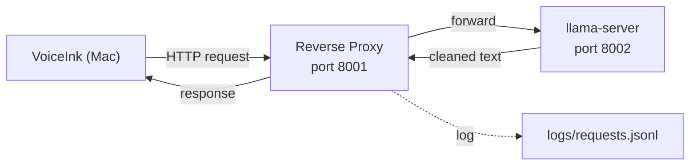
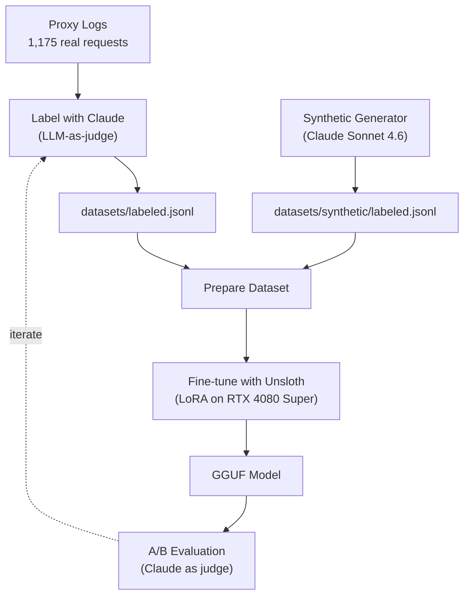
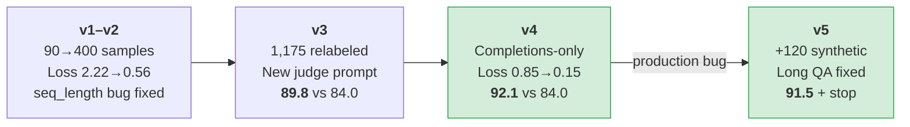
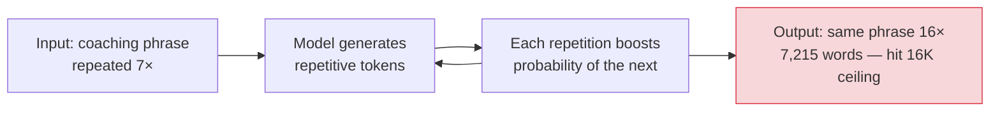

# Fine-Tuning a 2B Model to Beat 4B and 9B: Building a Real-Time Dictation Pipeline with Qwen, Unsloth, and Claude

*How I built a complete fine-tuning pipeline — from raw speech-to-text logs to a deployed model that's faster and better than models twice and four times its size — using a gaming GPU, open-source tools, and Claude as my judge, labeler, and synthetic data generator.*

---

## Why This Exists

I build [GT Coach](https://gtcoach.app) ([GitHub](https://github.com/gt-coach/gt-coach-releases/releases)), a sim-racing coaching app for Gran Turismo 7. It's a solo project, and I do a lot of my development through coding agents — Claude Code, mostly. I use [VoiceInk](https://voiceink.app), a macOS dictation app, to talk to these agents by voice. I dictate instructions, questions, code reviews, debugging sessions. VoiceInk transcribes my speech, cleans it up with an LLM, and sends the result to whatever tool I'm working in.

The dictation workflow has two distinct modes:

**Short dictation** — the common case. Quick instructions to a coding assistant: "Can you check the previous lap for timing data?" or "Fix the bug in the coaching overlay." These are 10-100 words, fired hundreds of times a day.

**Long QA debriefs** — the edge case that matters. When I QA-test GT Coach, I drive in the simulator while the coaching app speaks corner-by-corner feedback aloud ("Corner 2, brake one beat earlier. It carried into corner 3. Your mid-corner speed is down."). I narrate my observations into a microphone using Apple's Voice Memo app, then upload the recording to VoiceInk for transcription. These debriefs run 2,000-3,500 words — thirty minutes of driving commentary interleaved with repeated coaching phrases.

Both modes need real-time cleanup. My raw dictation comes with filler words ("so", "like", "basically"), French grammar patterns (I'm a native French speaker — "we are Monday" instead of "today is Monday", "it depends of" instead of "it depends on"), and speech-to-text misrecognitions. The LLM's job is to fix all of that transparently, so my coding assistant or my notes get clean text.

Here's what that looks like in practice — real samples from the training data, showing the raw speech-to-text output and the cleaned version:

> **Raw:** So if you reflect on all the messages I've sent to you in this conversation, I've actually dictated all of them through Voice Inc. and they all went through QEN 3.5 Forbi.
>
> **Cleaned:** If you reflect on all the messages I've sent to you in this conversation, I've dictated all of them through VoiceInk and they all went through Qwen 3.5 4B.

Fillers removed ("so", "actually"), STT misrecognitions fixed ("Voice Inc." → "VoiceInk", "QEN 3.5 Forbi" → "Qwen 3.5 4B").

> **Raw:** the Allian lab shows a much later breakpoint into term three.
>
> **Cleaned:** The alien lap shows a much later brake point into turn 3.

Four STT errors in eleven words: "Allian" → "alien", "lab" → "lap", "breakpoint" → "brake point", "term three" → "turn 3".

> **Raw:** The breakpoint for chicken 17 is about 50 meters before the entry.
>
> **Cleaned:** The brake point for chicane 17 is about 50 meters before the entry.

Domain-specific phonetic corrections: "breakpoint" → "brake point", "chicken" → "chicane".

> **Raw:** So I think the correct fix is probably there's two fixes we need to do. One is we need to mutate locally this reference package, which I believe is a binary file with like the prefixes, some kind of like metadata to switch from monza to monza node chicain
>
> **Cleaned:** I think there are two fixes we need to do. One is we need to locally mutate this reference package, which I believe is a binary file with the prefixes, some kind of metadata to switch from Monza to Monza No Chicane.

Fillers removed ("so", "like"), French word order fixed ("mutate locally this" → "locally mutate this"), grammar corrected ("there's two" → "there are two"), STT errors fixed ("monza node chicain" → "Monza No Chicane").

## The Infrastructure

### Starting Simple

The initial setup was just [llama.cpp](https://github.com/ggerganov/llama.cpp) (`llama-server`) running on my gaming PC — an RTX 4080 Super with 16GB VRAM, sitting on the network. VoiceInk pointed at the server's IP. The [Qwen 3.5 small models](https://qwen.ai/blog?id=qwen3.5) (2B, 4B, 9B) had just been released on March 2, 2026 so I was experimenting with different sizes and quantization levels to find the right tradeoff between quality and speed.

The results were mixed. The larger models produced decent quality but were noticeably slow — every dictation had a perceptible delay before the cleaned text appeared:

| Model | Tokens/sec | Time to first token |
|---|---|---|
| 9B | ~90 | ~300ms |
| 4B | ~140 | ~280ms |
| 2B | ~250 | ~150-200ms |

The 2B was fast but terrible at following the cleanup instructions. And across all sizes, the models would misrecognize sentences, produce unclear cleanups, fail to correct obvious STT errors, or — worse — answer questions from the transcript instead of cleaning them. I was constantly noticing problems in the output but had no way to systematically understand what was going wrong. I couldn't inspect what VoiceInk was sending, what the model was producing, or correlate specific inputs with bad outputs. And I knew that if I ever wanted to fine-tune to fix these issues, I'd need training data.

### Adding the Logging Proxy

That's when I built a lightweight Python reverse proxy ([`src/voiceink_proxy/server.py`](https://github.com/hourliert/VoiceInk-Qwen3.5-2B-FT/blob/master/src/voiceink_proxy/server.py)) that sits between VoiceInk and llama-server. It forwards every request transparently and logs the complete request/response pair as JSONL — the raw Parakeet transcript, the system prompt, the custom vocabulary, clipboard context, window context, the model's cleaned output, latency, everything.



This turned out to be the single most important decision in the project. Every dictation I did from that point on was automatically collected as training data. Over a thousand real-world samples, passively, with zero annotation effort.

The proxy also handles a quirk of Qwen 3.5: even with thinking mode disabled, the model occasionally leaks `</think>` tokens into its output. The proxy injects `</think>` as a stop token into every request, catching these before they reach VoiceInk.

A [systemd service](https://github.com/hourliert/VoiceInk-Qwen3.5-2B-FT/blob/master/systemd/llama-router.service) runs both processes on boot via a [startup script](https://github.com/hourliert/VoiceInk-Qwen3.5-2B-FT/blob/master/bin/start.sh). The entire proxy is standard-library Python — no pip dependencies.

## The Model Progression

### Starting with 9B

I initially ran [Qwen 3.5 9B](https://huggingface.co/Qwen/Qwen3.5-9B) (Q4_K_XL quantization) for the cleanup task. At ~90 tokens/second on the RTX 4080 Super, it was accurate but noticeably slow. With a 16K context window and `flash-attn` enabled, it fit comfortably in VRAM, but the generation latency was distracting — especially on longer dictations.

### Moving to 4B

I switched to [Qwen 3.5 4B](https://huggingface.co/Qwen/Qwen3.5-4B) to improve speed. At ~140 tokens/second, it was a meaningful improvement, and the quality was essentially identical to 9B for short dictation. When I later ran formal evaluations, the 9B scored 82.9 and the 4B scored 82.3 on the same rubric — essentially indistinguishable.

But long QA debriefs were a different story. Both 9B and 4B would produce excessively long output on 3,000+ word transcripts, often hitting the context window ceiling without finishing. The models weren't stopping — they'd generate and generate until they ran out of space. This was a persistent problem I lived with.

### The STT Switch

Around this time, I also switched VoiceInk's speech-to-text engine from Whisper Large V3 Turbo to Parakeet V2. Parakeet was faster — important for real-time dictation — but introduced more phonetic misrecognitions. "Claude Code" became "cloud code", "brake" became "break", "GT Coach" became "D V Coach" or "GT couch". Real English words that sound right but mean something completely different.

This made the LLM cleanup step more important than before. The model wasn't just removing fillers and fixing grammar anymore — it needed to detect and correct phonetic substitutions using context clues and the custom vocabulary list VoiceInk provides.

### Trying 2B

The 4B latency was still noticeable, especially after getting used to Parakeet's faster transcription. I tested Qwen 3.5 2B with prompt engineering alone. It was fast — but it couldn't follow the cleanup instructions reliably. It would answer questions from the transcript instead of cleaning them, add commentary, miss filler words, fail to correct STT errors. The instruction-following gap between 2B and 4B was real and couldn't be closed with prompting.

That's when I decided to fine-tune.

## The Fine-Tuning Pipeline

The pipeline has four stages, each built as a standalone Python script:



### 1. Labeling ([`src/labeling/label.py`](https://github.com/hourliert/VoiceInk-Qwen3.5-2B-FT/blob/master/src/labeling/label.py))

Each raw transcript from the proxy logs gets sent to Claude Sonnet 4.6 with a carefully crafted [judge prompt](https://github.com/hourliert/VoiceInk-Qwen3.5-2B-FT/blob/master/src/labeling/judge_prompt.txt). The judge receives the transcript along with structured context — custom vocabulary, clipboard content, active window title — all automatically populated and sent by VoiceInk with every request — and produces the ideal cleaned version.

```
Raw proxy log entry
  → Extract transcript + vocabulary + context (src/common/extract.py)
  → Build judge prompt with structured placeholders
  → Claude Sonnet 4.6 produces gold-standard cleaned transcript
  → Save to datasets/labeled.jsonl (dedup by request_id)
```

The labeling runs with configurable parallelism (typically 5 concurrent calls). 1,175 samples took about 45 minutes.

**The judge prompt went through three major iterations:**

**v1** passed the entire raw request as a blob (`{original_input}`). Simple, but the judge had to parse XML tags itself, and it was hard to control what it focused on.

**v2** added rules based on manual review of labeled samples. I found the judge was over-cleaning — stripping genuine reactions like "Cool" and "That's fair", sometimes fabricating content, and producing sentence fragments. Each problem became an explicit rule: keep affirmations, keep standalone assessments, never fabricate, never fragment.

**v3** was a full rewrite aligned with a [product specification](https://github.com/hourliert/VoiceInk-Qwen3.5-2B-FT/blob/master/docs/PRODUCT_SPEC.md) I wrote to codify exactly what "good cleanup" means. The prompt switched to structured placeholders (`{transcript}`, `{custom_vocabulary}`, `{clipboard_context}`, `{window_context}`) fed by a shared [extraction module](https://github.com/hourliert/VoiceInk-Qwen3.5-2B-FT/blob/master/src/common/extract.py). It added guidance for French-English transfer patterns, Parakeet's phonetic misrecognitions (with real examples from my corpus like "slab" → "lap", "cloud code" → "Claude Code"), and a nuanced rule for "I think" — keep it when expressing a genuine opinion, remove only when it's clearly a throwaway hedge.

### 2. Dataset Preparation ([`src/training/prepare_dataset.py`](https://github.com/hourliert/VoiceInk-Qwen3.5-2B-FT/blob/master/src/training/prepare_dataset.py))

Converts labeled records into chat format matching Qwen 3.5's [ChatML](https://huggingface.co/docs/transformers/en/chat_templating) chat template, which is what Unsloth expects for training. The script extracts structured components from each labeled record and reconstructs messages using a configurable system prompt — decoupling training data from whatever prompt VoiceInk happened to send at recording time. This means I can iterate on the VoiceInk prompt without relabeling.

The output uses typed content blocks (required for Qwen 3.5's unified VLM architecture):

```json
{
  "messages": [
    {"role": "system", "content": [{"type": "text", "text": "<system prompt>"}]},
    {"role": "user", "content": [{"type": "text", "text": "<transcript + context>"}]},
    {"role": "assistant", "content": [{"type": "text", "text": "<gold-standard label>"}]}
  ]
}
```

Data is split 90/10 into train and eval sets with a seeded shuffle for reproducibility.

### 3. Training ([`src/training/finetune.py`](https://github.com/hourliert/VoiceInk-Qwen3.5-2B-FT/blob/master/src/training/finetune.py))

Fine-tuning uses [Unsloth](https://unsloth.ai/) ([GitHub](https://github.com/unslothai/unsloth)) for LoRA training on the [Qwen 3.5 2B](https://huggingface.co/Qwen/Qwen3.5-2B) base model. Qwen 3.5 is technically a unified vision-language model, which means using `FastVisionModel` and `UnslothVisionDataCollator` even for text-only input — even though no images are involved.

The training script evolved significantly across iterations. The first version was straightforward — default hyperparameters, training on the full sequence, export to GGUF. Over time, it picked up several features driven by real problems:

**Completions-only training**: The single biggest quality improvement. Using Unsloth's `UnslothVisionDataCollator` with `train_on_responses_only=True` masks the loss on everything except the assistant response. More on why this matters so much in [v4: Completions-Only Training](#v4-completions-only-training).

**Hyperparameter evolution**: LoRA rank went from 16 to 32, alpha from 16 to 64, epochs from 3 down to 1 (overfitting) then back to 2, learning rate bounced between 1e-4 and 2e-4 before settling on 2e-4 with a cosine scheduler. Batch size dropped from 2 to 1 with gradient accumulation increased from 4 to 8 — effectively the same batch size, but the lower per-device batch reduces peak VRAM per step, which became critical for fitting long sequences.

**Dataset snapshots**: Every training run automatically snapshots `labeled.jsonl` with a date and sample count (e.g., `labeled.20260310.1175samples.jsonl`). This makes each model version reproducible — you can always trace back exactly which data produced it.

**GGUF auto-backup**: Before overwriting an existing GGUF file during export, the script copies it to a versioned backup (`.v1.gguf`, `.v2.gguf`, etc.). This was added after I accidentally overwrote a model I wanted to compare against.

**Quantization flexibility**: The script supports `--load-in-4bit` and `--load-in-8bit` for the base model, plus `--offload-optimizer` to move Adam states to CPU. These were added to handle training on longer synthetic sequences that pushed past the 16GB VRAM limit (more on this in [The VRAM Problem](#the-vram-problem)).

### 4. Evaluation ([`src/eval/evaluate.py`](https://github.com/hourliert/VoiceInk-Qwen3.5-2B-FT/blob/master/src/eval/evaluate.py))

A comparative evaluation where Claude Sonnet 4.6 acts as judge. For each eval sample, both models produce output from the same input. The judge receives both outputs side-by-side in a single call — labeled "Output A" and "Output B" — and scores each on a [6-dimension rubric](https://github.com/hourliert/VoiceInk-Qwen3.5-2B-FT/blob/master/src/eval/judge_prompt.txt). This comparative approach (as opposed to scoring each output independently) lets the judge make fine-grained quality distinctions that would be hard to calibrate in isolation. The A/B assignment is randomized per sample to cancel out positional bias (LLM judges tend to slightly favor whichever output appears first).

| Dimension | Weight | What it measures | Why it matters for dictation |
|---|---|---|---|
| Meaning preservation | 3x | Did it faithfully represent what was said? | The model must never fabricate, drop, or alter the speaker's intent |
| Instruction following | 3x | Did it stay in role as a transcription enhancer? | Base models often answer questions from the transcript instead of cleaning them |
| Filler removal | 2x | Did it clean verbal tics and conversational fluff? | Raw dictation is dense with "so", "like", "basically" — the core cleanup task |
| Grammar/fluency | 2x | Did it fix errors, especially non-native patterns? | French-English transfer patterns ("depends of", "we are Monday") need correction |
| Technical accuracy | 2x | Did it get names and terms right per vocabulary? | Parakeet produces phonetic substitutions ("break" for "brake", "chicken" for "chicane") |
| Conciseness | 1x | Did it tighten unnecessary verbosity? | Lower weight — cleaning should preserve the speaker's voice, not rewrite it |

Each dimension is scored 1-5, weighted and normalized to a 0-100 overall score.

The evaluation pipeline had its own bugs to work through:

**`max_tokens: 256`**: The first version hardcoded a 256-token output cap in the eval inference call. This silently truncated model output — which meant the eval could never detect the long QA debrief repetition problem. The model was amplifying repetitions and filling the 16K context window in production, but eval never saw it because it cut output off at 256 tokens. Removing this cap to match production (VoiceInk sends no token limit) was essential for catching the bug.

**Cold-load latency bias**: llama-server lazy-loads models on first request. Whichever model was tested first appeared slower because its first inference included the model load time. Adding a warmup request before each model's timed run eliminated this.

**Judge response truncation**: The judge produces structured JSON with scores for 6 dimensions across 2 outputs. Early runs had responses getting cut off mid-JSON, causing parse failures. Adding retry logic (2 attempts with error logging) and expanding the response budget fixed this.

**Per-sample vocabulary**: Without passing each sample's custom vocabulary to the judge, it couldn't properly score technical accuracy. It had no way to know that "cloud code" should have been corrected to "Claude Code", or that "break" should be "brake" in a racing context.

## Training Iterations



### v1–v2: Getting the Foundations Right

The first training run used 90 labeled samples, 3 epochs, LoRA rank 16, and default hyperparameters. Loss dropped from 2.22 to 0.56 — the model learned the general shape of the task. But there was a configuration bug: `max_seq_length` was set to 16384 in the script, but never passed to `FastVisionModel.from_pretrained()`. Unsloth silently defaulted to 2048. The model had never seen a full-length VoiceInk prompt during training — the system prompt alone is over 2,000 tokens.

After fixing the sequence length bug and labeling more data (~400 samples), v2 trained on the full context. The model improved, but scores were inconsistent. Loss was high (~0.85 average) because the model was training on the entire sequence — trying to predict the system prompt, the user's transcript, and the assistant's response. More on why this matters below.

### v3: Better Labels

The turning point wasn't a training change — it was realizing that **label quality matters more than hyperparameters**.

I reviewed labeled samples and found the judge was over-cleaning: stripping genuine reactions like "Cool" and "That's fair", fabricating content that the speaker never said, and producing sentence fragments. I wrote a [product specification](https://github.com/hourliert/VoiceInk-Qwen3.5-2B-FT/blob/master/docs/PRODUCT_SPEC.md) to codify exactly what "good cleanup" means, then rebuilt the judge prompt from scratch — switching from a raw input blob to structured placeholders, adding explicit rules for each failure mode I'd found, and adding guidance for French-English transfer patterns and Parakeet's phonetic misrecognitions.

Then I relabeled all 1,175 samples with the new prompt. The training hyperparameters also evolved based on evaluation results: LoRA rank doubled from 16 to 32 (alpha 16 → 64), epochs dropped from 3 to 1 (3 was overfitting), and learning rate went to 1e-4.

The fine-tuned 2B scored 89.8 against the 4B baseline's 84.0. Closing the gap, but not yet surpassing it.

### v4: Completions-Only Training

This was the breakthrough — and it came from changing what the model trains on, not how.

I had been training on the entire sequence: system prompt, user message, and assistant response. But the system prompt and user message are provided at inference time; the model doesn't need to learn to predict them. Worse, VoiceInk's system message includes dynamic context that changes with every request — the current clipboard content, the active window title, the custom vocabulary. A 2B model was wasting significant capacity trying to learn patterns in this unpredictable context.

Switching to **completions-only training** masks the loss on everything except the assistant response. The model focuses entirely on learning to produce clean output given the input context, rather than trying to predict the context itself.

Using Unsloth's `UnslothVisionDataCollator` with `train_on_responses_only=True`, the average training loss dropped from ~0.85 to ~0.15. Combined with optimized hyperparameters — cosine learning rate scheduler (replacing linear), 2e-4 learning rate (back up from 1e-4), weight decay 0.01, 2 epochs, batch size 1 with gradient accumulation 8 — the results were striking:

| Eval | Fine-tuned 2B | Baseline | Gap |
|---|---|---|---|
| vs 4B | **92.1** | 84.0 | +8.1 |
| vs 9B | **92.1** | 82.9 | +9.2 |
| vs base 2B | **91.8** | 81.1 | +10.7 |

The fine-tuned 2B was now beating both the 4B and 9B models — at 2.2x the speed of the 4B and roughly 3x the speed of the 9B.

*These v4 evaluations used 130 eval samples with LLM-as-judge scoring. Full methodology and final results across all model sizes are in [Results](#results).*

## The Production Bug

I deployed v4 and started using it. Short dictation was excellent — faster, cleaner, more accurate than anything I'd had before.

Then I did a long QA debrief for [GT Coach](https://gtcoach.app).

I was driving on Dragon Trail with a Group 4 car, narrating observations while the coaching app spoke corner-by-corner feedback. I uploaded the 30-minute recording to VoiceInk. Parakeet transcribed it. The transcript went to the model for cleanup.

The model produced **7,215 words of output from a 3,266-word input**. It hit the 16K context window ceiling. The response took 40 seconds. The output was broken — cut off mid-sentence, full of amplified repetitions. VoiceInk detected the broken output and silently fell back to the raw Parakeet transcript, bypassing the cleanup step entirely.

### What Was Happening

The coaching app naturally says similar things each lap: "Corner 2, brake one beat earlier. It carried into corner 3. Your mid-corner speed is down." These phrases repeat because the driver makes similar mistakes each lap. A 6-lap session might have the same corner advice appearing 6-8 times — that's correct and should be preserved.

The model was amplifying this repetition. Where the input had a phrase 7 times, the output had it 16 times. Each repetitive token made the next one more likely, creating a positive feedback loop that filled the entire context window.



### Debugging

I replayed the same input against every model I had available. To fit the larger models, I tested quantized versions — the 35B-A3B (mixture-of-experts, only 3B active parameters, so still a high tok/s throughput for real-time dictation usage) at Q2_K_XL, the 9B at Q4_K_XL:

| Model | Finish reason | Output words | Repeated 8-grams |
|---|---|---|---|
| Fine-tuned 2B | `length` (hit ceiling) | 7,215 | ran away |
| 4B | `length` | 2,959 | 58 |
| 9B | `length` | 2,956 | 64 |
| 35B-A3B | `length` | 2,909 | 73 |

The 4B, 9B, and 35B all hit a 4,000-token cap — none of them stopped naturally. The repetition counts were similar across all three (the coaching phrases genuinely repeat in the input). But the fine-tuned 2B uniquely amplified the repetition to fill the entire 16K window.

I explored several potential fixes:

- **`frequency_penalty`** in the API call — this actually worked in testing (the model stopped naturally at 2,273 tokens with `frequency_penalty=0.5`), but it's a blunt instrument that could degrade quality on other inputs.
- **Hard-capping `max_tokens`** proportional to input length — this would truncate output mid-sentence, completely breaking the product. The whole point is to produce clean, complete text.
- **Chunking long transcripts** in the proxy — splitting at paragraph boundaries, processing each chunk separately, concatenating results. A viable approach but adds significant complexity.

None of these addressed the root cause.

### Root Cause

The training data distribution told the story:

| Input length | Samples | % of training data |
|---|---|---|
| 0-50 words | 858 | 68.5% |
| 50-100 words | 293 | 23.4% |
| 100-200 words | 86 | 6.9% |
| 200-500 words | 7 | 0.6% |
| 500+ words | **4** | **0.3%** |

Four samples over 500 words out of 1,175 total. The model had essentially zero representation of long, repetitive transcripts in its training data. It had never learned the pattern of "preserve coaching phrase repetitions faithfully without amplifying them."

## Synthetic Data

### Generating Realistic QA Debriefs

I built a [synthetic data generator](https://github.com/hourliert/VoiceInk-Qwen3.5-2B-FT/blob/master/src/synthetic/generate.py) that uses Claude Sonnet 4.6 to produce matched pairs of messy STT transcripts and gold-standard cleaned versions. The [generator prompt](https://github.com/hourliert/VoiceInk-Qwen3.5-2B-FT/blob/master/src/synthetic/generator_prompt.txt) includes:

- The exact coaching phrase structures from production: corners always referenced by numeric ID ("Corner 2", never "the first chicane"), braking instructions, consequence feedback, positive feedback, compound instructions
- Realistic Parakeet error patterns: "brake" → "break", "Claude Code" → "cloud code", "chicane" → "chick in", "telemetry" → "tell a mystery"
- French-English transfer patterns in the speaker's narration
- Natural structure: setup → live narration with coaching → bug observations → wrap-up

Each call produces both the raw transcript and the clean label in one shot, ensuring perfect alignment. 120 samples across varying lengths (500-3,500 words), with diversity across tracks, scenarios, and coaching patterns.

The generation is resumable — if it crashes at sample 60, rerunning the same command skips already-generated samples and continues from 61.

### The VRAM Problem

Training on the merged dataset (1,175 real + 120 synthetic) immediately hit out-of-memory errors that hadn't occurred before.

The reason is straightforward when you look at the numbers. During a training forward+backward pass, VRAM usage scales with sequence length. The key consumers are:

- **Activations stored for backpropagation**: even with gradient checkpointing (which recomputes activations during the backward pass instead of storing them all), the peak memory for a single layer's activations scales linearly with sequence length.
- **Cross-entropy loss computation**: the loss layer materializes a tensor of shape `(sequence_length × vocabulary_size)`. For Qwen 3.5's 248K vocabulary, an 11K-token sequence produces a ~5GB tensor — which is exactly what the OOM error reported (`Tried to allocate 4.90 GiB`).

Previously, the longest real training sample was ~9,600 tokens, and there was only one of them — the training usually got lucky and never hit it at a bad time. The synthetic samples added 20+ sequences over 9,000 tokens, with the longest at ~11,200. The probability of encountering a VRAM-busting sample went from negligible to near-certain.

I tried several approaches to fit the longer sequences:

- **CPU optimizer offload** (`--offload-optimizer`): moves Adam optimizer states (~2x model size) to CPU RAM. Saved ~800MB but not enough — the bottleneck was the forward pass, not the optimizer.
- **8-bit base model loading** (`--load-in-8bit`): reduces base model memory by ~2GB. Still not enough for the 11K-token cross-entropy tensor.
- **4-bit base model loading** (`--load-in-4bit`): reduces base model memory by ~3GB. Combined with optimizer offload, this freed enough headroom for the longest sequences.

The quality impact of 4-bit base model loading during LoRA training is minimal — the LoRA adapter weights are still trained and stored in full precision. The quantization only affects the frozen base model weights that gradients flow through.

### v5: The Fix

After retraining with the merged dataset:

**Short dictation** (the common case):
- Score: 91.5 vs 81.4 (4B baseline) — essentially unchanged from v4
- Speed: 2.1x faster than 4B

**Long QA debrief** (the bug):

| Metric | v4 (before) | v5 (after) |
|---|---|---|
| Finish reason | `length` (hit ceiling) | **`stop`** (natural) |
| Completion tokens | 10,294 | **2,484** |
| Time | 40.3 seconds | **9.8 seconds** |
| Output/input ratio | 2.2x (amplifying) | **0.57x** (compressing) |

The model now stops naturally, preserves all coaching phrase repetitions faithfully (without amplifying them), and finishes in under 10 seconds. The remaining repeated 8-grams in the output match the actual repetition in the input — the coach genuinely says similar things each lap.

## Results

After the final training run, I evaluated the fine-tuned 2B against every Qwen 3.5 model I could fit on the RTX 4080 Super (16GB VRAM). The 2B, 4B, and 9B baselines all use Q4_K_XL quantization (the recommended Unsloth dynamic quantization). The 35B-A3B is a mixture-of-experts model with only 3B active parameters — fast for its size, but it requires aggressive Q2_K_XL quantization to fit in 16GB, which degrades its quality. The fine-tuned model is exported as Q4_K_M GGUF.

| Model | Quant | Score | FT 2B | Gap | Win rate | Speed |
|---|---|---|---|---|---|---|
| Qwen 3.5 2B | Q4_K_XL | 79.7 | **91.1** | +11.4 | 77% (124/161) | 1.0x |
| Qwen 3.5 4B | Q4_K_XL | 81.4 | **91.5** | +10.1 | 77% (124/161) | 2.1x |
| Qwen 3.5 9B | Q4_K_XL | 81.6 | **90.9** | +9.3 | 75% (121/161) | 3.2x |
| Qwen 3.5 35B-A3B | Q2_K_XL | 84.5 | **91.8** | +7.3 | 67% (108/161) | 2.3x |

The fine-tuned 2B beats every model, including one 17× its size. The 35B-A3B is the strongest baseline — its MoE architecture helps even at 2-bit quantization — but still loses by 7.3 points with a 67% win rate.

The per-dimension scores reveal where fine-tuning makes the difference:

| Dimension | Weight | FT 2B | Baselines | Gap |
|---|---|---|---|---|
| Meaning preservation | 3x | 4.24–4.28 | 4.20–4.37 | ~0 |
| Instruction following | 3x | 4.94–4.96 | 4.78–4.96 | small |
| **Filler removal** | 2x | **4.37–4.43** | 2.68–3.22 | **+1.3** |
| **Grammar/fluency** | 2x | **4.57–4.65** | 3.71–4.25 | **+0.6** |
| Technical accuracy | 2x | 4.61–4.67 | 4.27–4.56 | +0.2 |
| **Conciseness** | 1x | **4.42–4.45** | 2.90–3.43 | **+1.2** |

Meaning preservation and instruction following are near-ceiling for all models — the base Qwen 3.5 architecture handles these well out of the box. The gap is entirely in filler removal, grammar, and conciseness: the exact behaviors that require task-specific training data to learn. No amount of prompt engineering gets a base model from 2.68 to 4.40 on filler removal.

*161 eval samples per comparison, LLM-as-judge scoring with Claude Sonnet 4.6. These are not statistical significance tests — the sample size and magnitude of the gaps give reasonable confidence, but this is practical evaluation, not a rigorous ML benchmark. The 35B-A3B comparison should be read with the caveat that Q2_K_XL quantization degrades quality — a less quantized 35B-A3B would likely score higher. The practical validation is deploying the model and using it daily for real dictation.*

## What I'd Do Differently

**Start with completions-only training from day one.** I trained three model versions on the full sequence before discovering that masking loss on the system prompt and user message was the single biggest quality lever. The loss drop from ~0.85 to ~0.15 tells you how much capacity was being wasted predicting tokens the model never needs to generate. If you're fine-tuning for any chat task where the system prompt contains variable context, this should be the default.

**Invest in the evaluation pipeline before training.** I built the eval after the first training run, and it had a hardcoded `max_tokens: 256` that silently truncated model output for weeks. The repetition amplification bug on long transcripts was invisible to eval the entire time — it could only manifest in production. If I'd tested the eval against known edge cases before trusting it, I would have caught this much earlier.

**Audit your training data distribution, not just your training data quality.** I spent significant effort improving label quality (three judge prompt iterations, a full product spec, a complete relabel, manual reviews) — and that was worth it. But I didn't look at the length distribution until the production bug forced me to. Four samples over 500 words out of 1,175 is obvious in hindsight. A histogram of input lengths should have been the first thing I checked.

**The proxy was the best decision in the project.** Every other component — labeling, training, evaluation, synthetic data — exists because the proxy was silently collecting real-world data from the start. 1,175 samples with zero annotation effort. If I'd tried to build a data collection workflow from scratch, I probably never would have started fine-tuning.

## The Stack

| Component | Tool |
|---|---|
| Base model | [Qwen 3.5 2B](https://huggingface.co/Qwen/Qwen3.5-2B) |
| Training | [Unsloth](https://unsloth.ai/) with LoRA on RTX 4080 Super (16GB VRAM) |
| Inference | [llama.cpp](https://github.com/ggerganov/llama.cpp) serving Q4_K_M GGUF |
| Labeling, evaluation, synthetic data | [Claude Sonnet 4.6](https://claude.ai) via Claude CLI |
| Development | [Claude Code](https://claude.ai/claude-code) |
| Dictation app | [VoiceInk](https://voiceink.app) with Parakeet V2 STT |

The full pipeline — from raw proxy logs to deployed GGUF — runs in five commands and takes about two hours end-to-end (45 minutes labeling, 30 minutes synthetic generation, 10 minutes dataset prep + training, 45 minutes evaluation). The model is running in production now, cleaning up every dictation I send through VoiceInk.

## Cost

The GPU is an RTX 4080 Super I bought for £800 — it's a gaming PC that doubles as an ML workstation. The entire training process was 5-6 runs at ~20 minutes each. The full PC draws about 500W from the wall during training, so that's roughly 1 kWh total. At London electricity rates (~£0.30/kWh), the compute cost of fine-tuning was under £1.

The real cost is the [Claude Max plan](https://claude.ai) subscription, which I use for development anyway. Labeling 1,175 samples, generating 120 synthetic samples, running evaluations, and building the entire codebase with Claude Code all ran through that subscription. No per-token API costs, no cloud GPU rentals, no training infrastructure to manage.

No part of this project required spending money I wasn't already spending.
